# windowskomutlari
 

## `calc.exe` Komutu
Hesap makinesini açmaya yarar.
```Bash
calc.exe
```

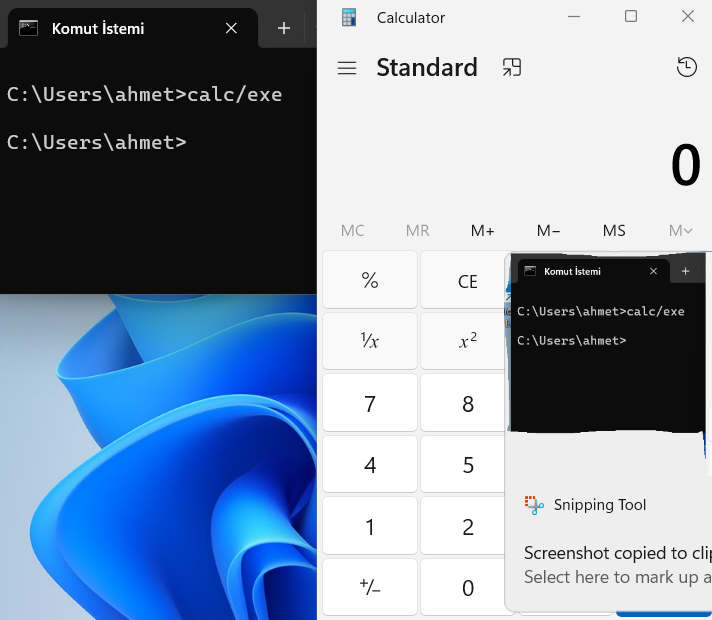


## `diskmgmt.msc ` Komutu
Disk yönetimini açmaya yarar.

```Bash
diskmgmt.msc
```

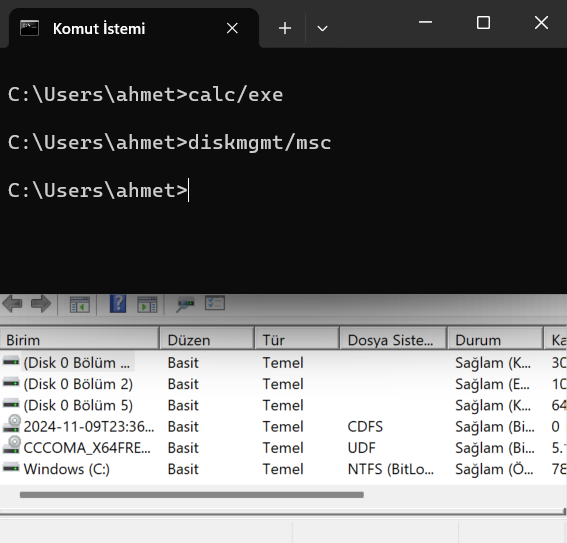


## `devmgmt.msc` Komutu
Aygıt yöneticisini açmaya yarar.

```Bash
devmgmt.msc
```

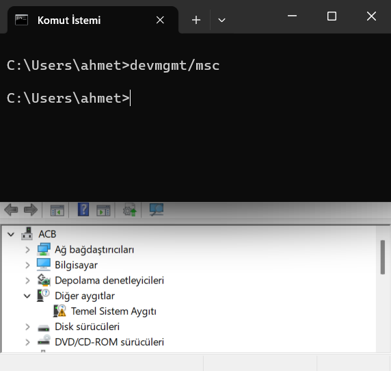


## `eudcedit.exe` Komutu
Karakter imal etmeye yarar (kişisel emoji oluşturulabilir).

```Bash
eudcedit.exe
```

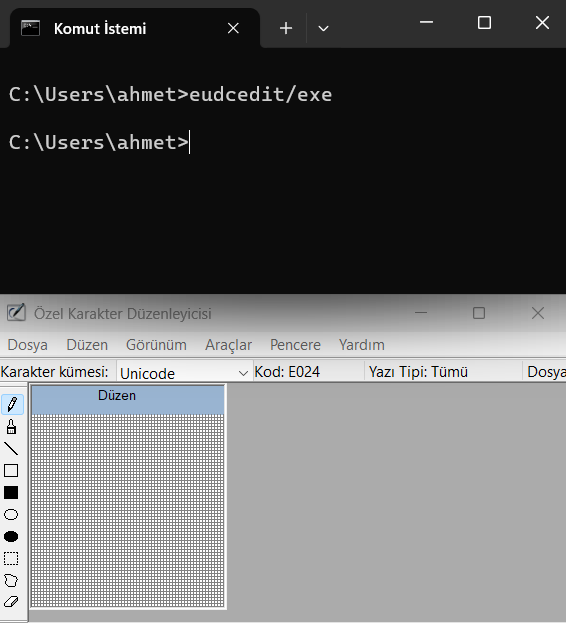


## `fsmgmt.msc` Komutu
Paylaşılan klasör menüsünü açmaya yarar.

```Bash
fsmgmt.msc
```

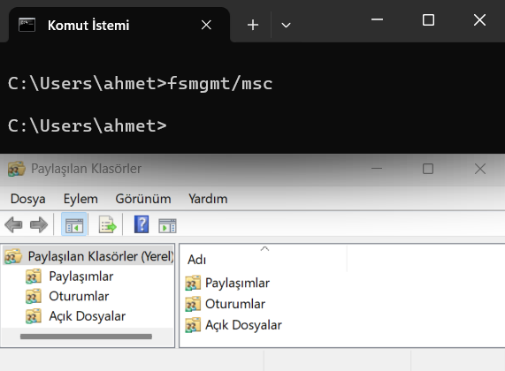


## `hdwwiz.cpl` Komutu
Donanım ekleme sihirbazını açmaya yarar.

```Bash
hdwwiz.cpl
```

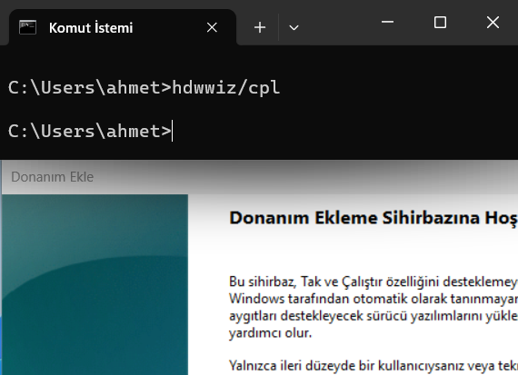


## `magnify.exe` Komutu
Büyüteçi açmaya yarar.
```Bash
magnify.exe
```

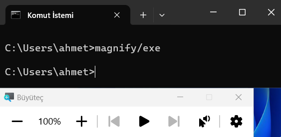


## `narrator.exe` Komutu
Ekran okuyucusunu açmaya yarar.

```Bash
narrator.exe
```

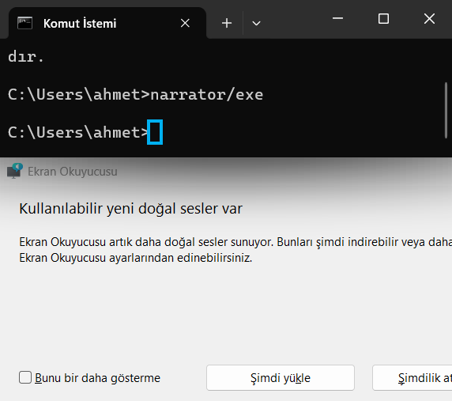


## `osk.exe` Komutu
Ekran klavyesini açmaya yarar.

```Bash
osk.exe
```

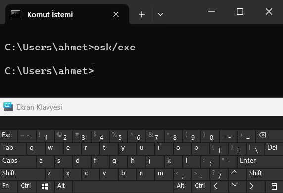


## `explorer.exe` Komutu
Windows Gezgini’ni açmaya yarar.

```Bash
explorer.exe
```

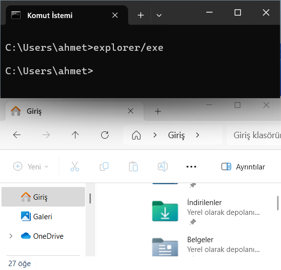


## `taskmgr.exe` Komutu
Görev yöneticisini açmaya yarar.

```Bash
taskmgr.exe
```

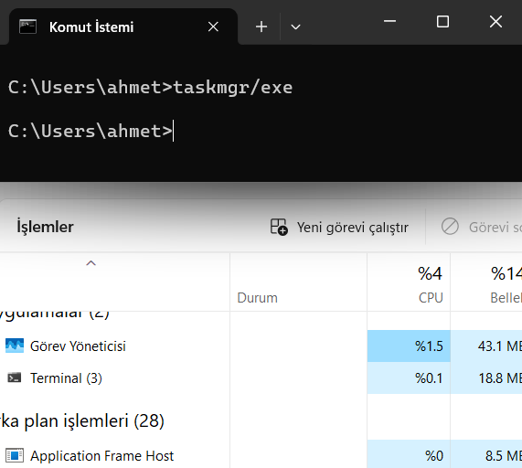


## `logon.exe` Komutu
Windows’u yeniden başlatmaya yarar.
```Bash
logon.exe
```

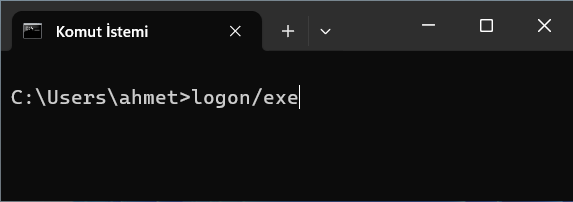


## `nslookup.exe` Komutu
Hangi ağa bağlanıldı ise IP adresini bulmaya yarar.

```Bash
nslookup.exe
```

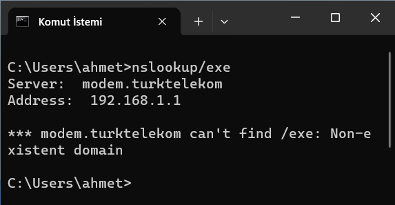


## `netstat -a` Komutu
Tüm bağlantıları göstermeye yarar.
```Bash
netstat -a
```

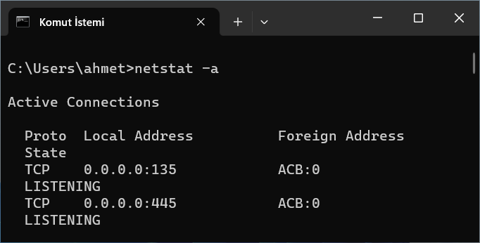


## `netstat -e ` Komutu
Ethernet istatistiklerini görüntülemeye yarar.

```Bash
netstat -e
```

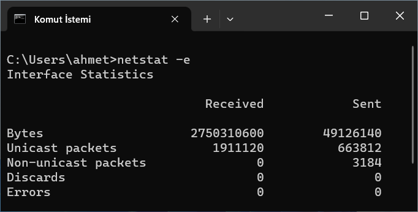


## `netstat -o` Komutu
Her bağlantıya sahip işlem kimliğini göstermeye yarar.

```Bash
netstat -o
```

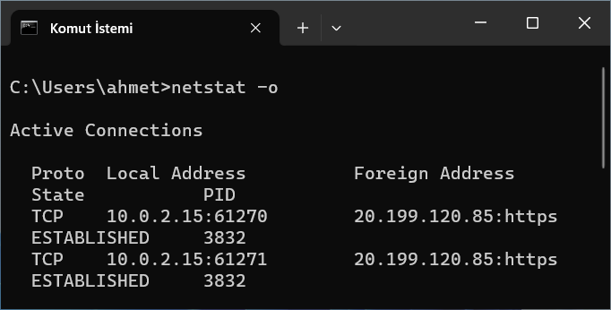


## `winver` Komutu
Windows sürümünün bilgilerini gösterir.
```Bash
winver
```

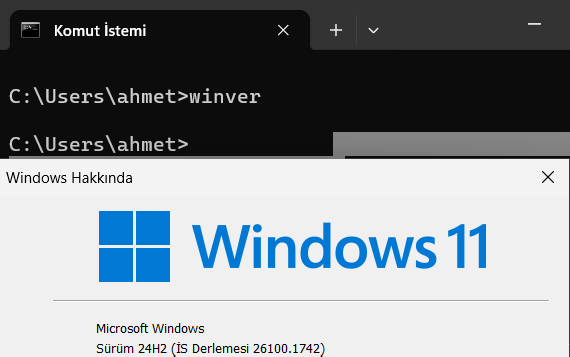


## `ipconfig` Komutu
Bilgisayarın bağlı olduğu ağdaki IP adresini göstermeye yarar.

```Bash
ipconfig
```

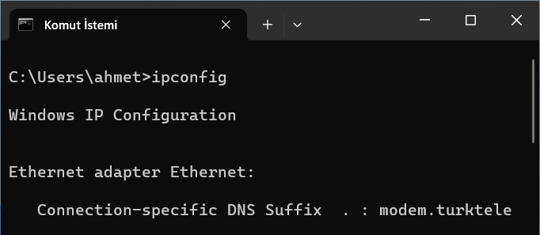


## `shutdown` Komutu
Bilgisayarı kapatmaya yarar.

```Bash
shutdown
```

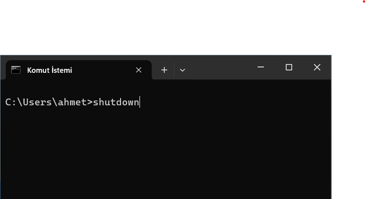


## `rmdir` Komutu
Var olan veya tamamen boş olan dosyayı siler.

```Bash
rmdir
```

