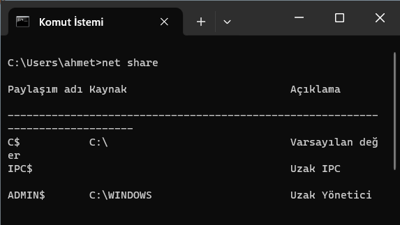
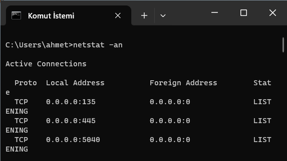
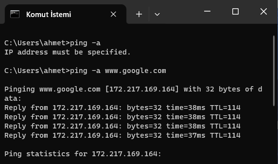
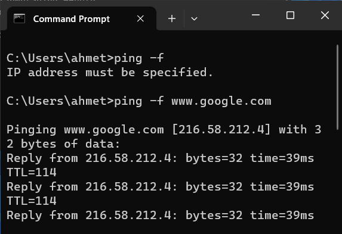
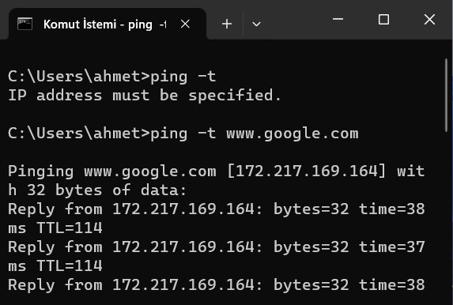
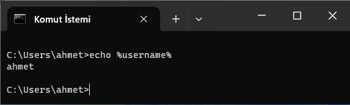

# windowskomutlari

# Sistem yönetim komutları

## `diskmgmt.msc ` Komutu
Disk yönetimini açmaya yarar.

```Bash
diskmgmt.msc
```


## `devmgmt.msc` Komutu
Aygıt yöneticisini açmaya yarar.

```Bash
devmgmt.msc
```


## `fsmgmt.msc` Komutu
Paylaşılan klasör menüsünü açmaya yarar.

```Bash
fsmgmt.msc
```


## `hdwwiz.cpl` Komutu
Donanım ekleme sihirbazını açmaya yarar.

```Bash
hdwwiz.cpl
```


## `taskmgr.exe` Komutu
Görev yöneticisini açmaya yarar.

```Bash
taskmgr.exe
```


## `bcdedit` Komutu
Paylaşılan klasör menüsünü açmaya yarar.

```Bash
bcdedit
```


## `chkdsk` Komutu
Diskleri tarar ve hataları onarır.

```Bash
chkdsk
```


## `compmgmt.msc` Komutu
Bilgisayar Yönetimi aracını açar.
```Bash
compmgmt.msc
```


## `dfrgui` Komutu
Disk Birleştirici aracını açar.

```Bash
dfrgui
```


## `diskpart` Komutu
 Disk bölümlerini yönetir.

```Bash
diskpart
```


## `eventnwr` Komutu
Olay Görüntüleyiciyi açar.

```Bash
eventnwr
```


## `perfmon` Komutu
Performans Monitörünü açar.

```Bash
perfmon
```


## `regedit` Komutu
Kayıt Defteri Düzenleyicisini açar.

```Bash
regedit
```


## `services.msc` Komutu
Hizmetler yönetim aracını açar.

```Bash
services.msc
```


## `sfc` Komutu
Sistem dosyalarını tarar ve onarır.

```Bash
sfc
```


# Yardımcı Programlar

## `charmap` Komutu
Karakter Eşlem aracını açar.

```Bash
charmap
```


## `dxdiag` Komutu
 DirectX Tanı Aracını açar.

```Bash
dxdiag
```


## `explorer` Komutu
Dosya Gezgini'ni başlatır.

```Bash
explorer
```


## `msinfo32` Komutu
 Sistem bilgilerini açar.

```Bash
msinfo32
```


## `mspaint` Komutu
Microsoft Paint uygulamasını başlatır.

```Bash
mspaint
```


## `osk` Komutu
Ekran klavyesini açar.

```Bash
osk
```


## `snippingtool` Komutu
Ekran Alıntısı Aracını açar.

```Bash
snippingtool
```


## `calc.exe` Komutu
Hesap makinesini açmaya yarar.
```Bash
calc.exe
```


## `magnify.exe` Komutu
Büyüteçi açmaya yarar.
```Bash
magnify.exe
```


## `narrator.exe` Komutu
Ekran okuyucusunu açmaya yarar.

```Bash
narrator.exe
```


## `osk.exe` Komutu
Ekran klavyesini açmaya yarar.

```Bash
osk.exe
```


# Ağ ve Komut Satırı Araçları

## `arp -a` Komutu
ARP (Adres Çözümleme Protokolü) önbelleğini gösterir.

```Bash
arp -a
```


## `getmac` Komutu
Ağ adaptörlerinin MAC adreslerini gösterir.

```Bash
getmac
```


## `ipconfig/all` Komutu
Ağ adaptörlerinin tüm yapılandırma bilgilerini gösterir.

```Bash
ipconfig/all
```


## `nbtstat -n` Komutu
 NetBIOS ad tablosunu gösterir.

```Bash
nbtstat -n
```


## `net share` Komutu
Paylaşılan kaynakları gösterir veya yönetir.

```Bash
net share
```



## `net user` Komutu
Kullanıcı hesaplarını listeler ve yönetir.

```Bash
net user
```


## `netstat -an` Komutu
Ağ bağlantıları ve aktif portlar listelenir (IP ve port numarasıyla).
```Bash
netstat -an
```



## `ping -a` Komutu
Ping ile hedefin IP adresinin karşılık geldiği ana bilgisayar adı gösterilir.
```Bash
ping -a
```



## `ping -f` Komutu
Ekran klavyesini açmaya yarar.

```Bash
ping -f
```



## `ping -t` Komutu
Hedefe sürekli ping gönderir, bağlantıyı kesene kadar devam eder.
```Bash
ping -t
```



## `ping` Komutu
Ping komutu, bir ağ cihazına veri paketleri göndererek o cihazın erişilebilir olup olmadığını ve yanıt süresini test eder.
```Bash
ping
```


## `tracert` Komutu
Bir IP adresine giden yolu izler.

```Bash
tracert
```


## `nslookup.exe` Komutu
Hangi ağa bağlanıldı ise IP adresini bulmaya yarar.

```Bash
nslookup.exe
```


## `netstat -a` Komutu
Tüm bağlantıları göstermeye yarar.
```Bash
netstat -a
```


## `netstat -e ` Komutu
Ethernet istatistiklerini görüntülemeye yarar.

```Bash
netstat -e
```


## `netstat -o` Komutu
Her bağlantıya sahip işlem kimliğini göstermeye yarar.

```Bash
netstat -o
```


## `ipconfig` Komutu
Bilgisayarın bağlı olduğu ağdaki IP adresini göstermeye yarar.

```Bash
ipconfig
```


# Sistem Bilgileri

## `driverquery` Komutu
Yüklü sürücülerin listesini gösterir.
```Bash
driverquery
```


## `driverquery/v` Komutu
Yüklü sürücülerin ayrıntılı listesini gösterir.```Bash
driverquery/v
```


## `echo %username%` Komutu
 Geçerli kullanıcı adını gösterir.
```Bash
echo %username%
```




## `gpresult/r` Komutu
Grup ilkesi raporunu gösterir.
```Bash
gpresult/r
```


## `sachtasks` Komutu
 Zamanlanmış görevleri yönetir veya listeler.
 ```Bash
sachtasks
```


## `systeminfo` Komutu
 Bilgisayarın sistem bilgilerini listeler.
 ```Bash
systeminfo
```


## `tasklist/svc` Komutu
Çalışan işlemleri ve ilişkili servisleri gösterir.
```Bash
tasklist/svc
```


## `winver` Komutu
Windows sürümünün bilgilerini gösterir.
```Bash
winver
```


# Dosya ve Dizin Yönetimi

## `explorer.exe` Komutu
Windows Gezgini’ni açmaya yarar.

```Bash
explorer.exe
```


## `rmdir` Komutu
Var olan veya tamamen boş olan dosyayı siler.

```Bash
rmdir
```


## `dir` Komutu
Geçerli dizindeki dosya ve klasörleri listeler.

```Bash
dir
```


# Yazı ve Karakter Düzenleme


## `eudcedit.exe` Komutu
Karakter imal etmeye yarar (kişisel emoji oluşturulabilir).

```Bash
eudcedit.exe
```


# Oturum Açma ve Kapatma Komutları 

## `logon.exe` Komutu
Windows’u yeniden başlatmaya yarar.
```Bash
logon.exe
```


## `shutdown` Komutu
Bilgisayarı kapatmaya yarar.

```Bash
shutdown
```


## `logoff` Komutu
Geçerli kullanıcı oturumunu kapatır.

```Bash
logoff
```


## `shutdown/a` Komutu
Planlanmış bir kapatma işlemini iptal eder.

```Bash
shutdown/a
```


## `shutdown/r` Komutu
Bilgisayarı yeniden başlatır.

```Bash
shutdown/r
```


## `shutdown/s` Komutu
 Bilgisayarı kapatır.

```Bash
shutdown/s
```


## `tsdiscon` Komutu
Uzak masaüstü oturumunu keser.

```Bash
tsdiscon
```


